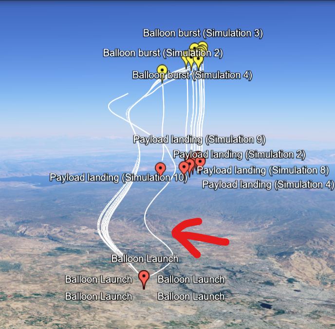

# Balloon Trajectory Simulator

This code implements a simulation of the flight of a balloon starting from a given point on the globe at a certain time. For the simulation, the weather forecast (wind directions) for the corresponding time is downloaded from GFS.

## File System

* hap_physics_engine.py: the main code to run, it simulates the balloon flight (contain all balloon's params)
* astra_GFS.py: for interacting with the NOAA's Global Forecast System, original code - 
* global_tools.py: tools for interacting with GFS, original code - 
* interpolate.py: interpolate the data from GFS, original code - ; it does interpolation of data with 4 parametres: lon, lat, press, time
* kml_generator.py: generate .kml file from list of coordinates (lat, lon, alt)

## astra_GFS.py more detailed

Use GFS_Handler for downloading forecast from NOAA's GFS. GFS_Handler gets latitude, longitude and time from which it is starting to downoload the data. 

The difference compare to the original ASTRA function are following:
* it useds U and V instead of wind velocity and direction (U is the velocity towards East and V is the velocity towards North)
* the temperature is calculated with Kelvin (not Celsius)

## Run the code 
* activate HAP environment in the server (hap)
* run `python hap_physics_engine.py` command  to start simulation

The output of the simulation is coordinates which can be converted to .kml file (using `kml_generator.py`) and put in Google Earth to see the trajectory on the map.

## Results

